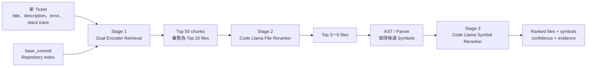

# 錯誤定位模型架構與評估規格

> 實作狀態（2026-08-15）：本文件的 Dual Encoder 是目標架構，不是目前已選定模型。已封存的 Stage-1 v11 使用 TF-IDF + high-precision domain/path routing；完整 Development Recall@20 為 93.33%，一次性跨專案 Holdout 為 84.44%。實作、消融與限制請見 `reports/fault_localization/STAGE1_V11_FINAL_REPORT_ZH.md`。

> 文件狀態：v1 設計基準（Source of Truth）
> 適用範圍：`fault_localization_feature_files` 後續的資料準備、模型訓練、推斷與評估
> 實作規則：開始修改模型或訓練腳本前，先閱讀本文件；若實作決策與本文件不同，應先更新本文件並說明原因。

## 1. 目標與成功條件

本功能接收一張新的 Bug Ticket，以及該 Ticket 對應 Repository 在 `base_commit` 的修正前程式碼，輸出依可疑程度排序的：

1. 檔案位置（file-level localization）。
2. 函式、Method 或 Class（symbol-level localization）。
3. 程式碼行範圍（line range，輔助資訊）。
4. 信心分數與是否需要人工檢查。

模型的任務是「定位可能有錯的程式碼」，不是在此階段產生修正 Patch。Patch generation 屬於定位完成後的另一項功能。

### 1.1 主要成功條件

| 層級 | 主要問題 | 主要指標 |
|---|---|---|
| Candidate retrieval | 正確檔案是否進入可供後續判斷的候選集合？ | Candidate Hit@20、Candidate Recall@20 |
| File-level | 正確檔案是否排在前面？ | File Hit@1/3/5、File MRR、File Recall@5 |
| Symbol-level | 正確 Function、Method 或 Class 是否排在前面？ | Exact Symbol Hit@1/3/5、Symbol MRR |
| Symbol 階段診斷 | 已經找到正確檔案後，Symbol 排序是否正確？ | Conditional Symbol Hit@K |
| 實際可用性 | 推斷是否夠快、信心是否可靠？ | p50/p95 latency、coverage、calibration |

## 2. 現有系統與目標系統的差異

現有系統是 retrieval-first baseline：

```text
Ticket
  -> Repository code index
  -> TF-IDF / SBERT / hybrid retrieval
  -> 規則訊號加權
  -> 檔案彙整
  -> 可選的 Ollama rerank
  -> Top-K 結果與信心門檻
```

目標系統保留既有索引、輸出格式與 fallback，但把候選檢索和排序改成可監督訓練：

```text
Ticket
  -> Stage 0：base_commit 程式碼索引
  -> Stage 1：可訓練 Dual Encoder 候選檢索
  -> Stage 2：Code Llama File Reranker
  -> Stage 3：Code Llama Symbol Reranker
  -> 信心校正、人工檢查門檻與 JSON 輸出
```

既有 TF-IDF、SBERT 和規則式方法必須保留，作為：

- baseline；
- Dual Encoder 的 hard-negative 來源；
- 模型無法載入或推斷逾時時的 fallback。

## 3. 名詞定義

| 名詞 | 本專題中的定義 |
|---|---|
| File-level | 預測哪一個程式碼檔案包含錯誤，例如 `django/db/backends/sqlite3/creation.py` |
| Symbol-level | 預測檔案內的 Function、Method、Class 或 `<module>` |
| Qualified symbol | 包含所屬 Class 的完整名稱，例如 `DatabaseCreation.test_db_signature` |
| Exact symbol ID | `file_path::qualified_symbol`，例如 `creation.py::DatabaseCreation.test_db_signature` |
| Candidate retrieval | 從整個 Repository 快速篩選出少量候選程式碼 |
| Reranking | 對候選集合進行較慢但較精確的重新排序 |
| Ground truth | 從開發者 Patch 推導出的正確修改檔案與 Symbol，只能用作標籤和評估答案 |
| Hard negative | 看起來與 Ticket 很相關，但實際未被 Patch 修改的檔案或 Symbol |

## 4. 整體模型架構



### 4.1 Stage 0：Repository 索引

索引只能使用 `base_commit`，也就是問題修正前的程式碼 snapshot。不得索引修正後程式碼。

每個 `CodeChunk` 至少需要保存：

```json
{
  "chunk_id": "stable-id",
  "file_path": "django/db/backends/sqlite3/creation.py",
  "language": "python",
  "symbol_kind": "method",
  "symbol_name": "test_db_signature",
  "symbol_qualified_name": "DatabaseCreation.test_db_signature",
  "symbol_id": "django/db/backends/sqlite3/creation.py::DatabaseCreation.test_db_signature",
  "start_line": 88,
  "end_line": 103,
  "code_text": "..."
}
```

實作注意事項：

- Python 使用 AST 取得精確範圍與 `Class.method` 完整名稱。
- 其他語言優先使用可取得的 parser；簡易 regex 結果必須標示 extraction confidence。
- `<module>` 代表 import、常數或模組層級程式碼。
- `symbol_id` 必須包含 `file_path`，避免不同檔案出現同名函式時誤判為相同答案。

### 4.2 Stage 1：Dual Encoder 候選檢索

Dual Encoder 有兩條獨立編碼流程：

```text
Ticket Encoder：Ticket 文字 -> query vector
Code Encoder：CodeChunk 內容 -> code vector
                         ↓
                   cosine similarity
```

Code vectors 可以在建立 Repository index 時預先計算。新 Ticket 進入時只需要計算一次 query vector，因此適合搜尋大量程式碼。

#### v1 模型決策

| 項目 | v1 設計 |
|---|---|
| Backbone | 可同時表示自然語言與程式碼的 pretrained code encoder |
| 邏輯結構 | Ticket tower 與 Code tower；v1 可共享 backbone 權重並使用不同 task prefix |
| Pooling | attention mask 下的 mean pooling 或模型原生 pooled embedding |
| 相似度 | cosine similarity |
| 訓練損失 | In-batch InfoNCE / Multiple Negatives Ranking Loss |
| 第一階段輸出 | Top 50 chunks，依最高分或聚合分數整理成 Top 20 files |

建議的索引文字：

```text
[CODE]
path: django/db/backends/sqlite3/creation.py
language: python
symbol: DatabaseCreation.test_db_signature
imports/signatures/docstring
code body
```

#### Stage 1 訓練樣本

- 正樣本：`fixed_files` 中的所有檔案，以及 Patch 行號對應的正確 chunks。
- Hard negatives：現有 TF-IDF/SBERT 排名前面、但不在 `fixed_files` 的同 Repository 候選。
- Random negatives：相同 Repository 中隨機選出的未修改檔案。
- 多檔案修正：每個正確檔案都建立正樣本，不可以只保留第一個檔案。

v1 預設每個正樣本搭配 8 個 hard negatives 和 2 個 random negatives。實際比例由 development split 調整。

訓練損失：

```text
L_retrieval = -log(
    exp(sim(query, positive) / temperature)
    / sum(exp(sim(query, candidate_j) / temperature))
)
```

Stage 1 的 early-stopping 指標是 Candidate Recall@20，不是 File Hit@1。因為這一階段的責任是「不要漏掉正確檔案」。

### 4.3 Stage 2：Code Llama File Reranker

Code Llama 不閱讀整個 Repository，只判斷 Stage 1 提供的 Top 20 files。

每個候選檔案的輸入由以下資料組成：

```text
[TASK=FILE_LOCALIZATION]

[TICKET]
title
description
error message / logs / stack trace / reproduction

[CANDIDATE_FILE]
file path
language
imports
class/function signature list
module docstring
Stage 1 分數最高的 2～3 個 code chunks
```

#### v1 模型決策

| 項目 | v1 設計 |
|---|---|
| Base model | Code Llama 7B Instruct |
| 訓練方式 | 4-bit QLoRA |
| 任務型態 | Candidate relevance scoring，不生成解釋文字 |
| 訓練損失 | Pairwise RankNet loss |
| 候選數 | 每張 Ticket 最多 rerank 20 個檔案 |
| 初始 context | 4,096 tokens；另做 2K/8K ablation |
| 輸出 | 每個候選檔案一個未校正 relevance score |

Pairwise loss：

```text
L_file = -log(sigmoid(score(ticket, positive_file)
                      - score(ticket, negative_file)))
```

File Reranker 輸出 Top 3～5 files，交給 Symbol 階段。若 Code Llama 失敗、逾時或輸出無效，必須回退到 Stage 1 排名。

### 4.4 Stage 3：Code Llama Symbol Reranker

只展開 Stage 2 排名前 3～5 個檔案內的 Symbols，避免對整個 Repository 的所有函式逐一執行 Code Llama。

Symbol 輸入格式：

```text
[TASK=SYMBOL_LOCALIZATION]

[TICKET]
title + description + error evidence

[CANDIDATE_SYMBOL]
file path
qualified symbol name
symbol kind
docstring / signature
symbol body
附近程式碼與必要 imports
```

#### v1 模型決策

- 使用相同 Code Llama 7B base model，但載入獨立的 `symbol_rerank` LoRA adapter。
- File 和 Symbol adapter 分開訓練，避免 Symbol 標註較少或較吵時破壞 File 排序。
- Symbol hard negatives 優先選相同檔案、相同 Class 或名稱相似的其他 Symbols。
- 精確答案使用 `file_path::qualified_symbol`，不能只比較短函式名稱。
- 最終輸出 Top 10 symbols，主要報告 Hit@1/3/5。

### 4.5 信心校正與人工檢查

模型原始 score 不能直接當成「80% 正確」。應在 validation split 使用 temperature scaling 或 isotonic regression 校正。

信心判斷至少考慮：

- Top-1 的校正後機率。
- Top-1 與 Top-2 的分數差距。
- Stage 1、File Reranker 和 Symbol Reranker 是否一致。
- Ticket 是否過短、缺少錯誤證據，或模型是否使用 fallback。

低信心結果仍可提供定位建議，但必須設定 `should_manual_review=true`，不可直接進入自動 Patch 產生。

## 5. 資料欄位與使用規則

### 5.1 Production 推斷可用欄位

| 欄位 | 是否使用 | 說明 |
|---|---:|---|
| `ticket_id` | 是 | 串接輸入、輸出與評估，不作為語意特徵 |
| `title` | 是 | Ticket 摘要 |
| `description` / `bug_report` | 是 | 主要問題描述 |
| `error_message` / `logs` | 有則使用 | 錯誤訊息與 stack trace |
| `steps_to_reproduce` | 有則使用 | 重現方法 |
| `component` | 有則使用 | 可作為弱提示 |
| `repo` | 是 | 決定要搜尋的 Repository |
| `base_commit` | 是 | 建立修正前程式碼 snapshot |

### 5.2 Benchmark 額外欄位

| 欄位 | Production 主結果 | Benchmark ablation | 原因 |
|---|---:|---:|---|
| `hints_text` | 不使用 | 可加入 | 新 Ticket 不一定有後續討論提示 |
| `fail_to_pass` | 不使用 | 可加入 | 新 Ticket 不一定已經建立正式失敗測試 |
| `pass_to_pass` | 不使用 | 通常不加入 | 主要用於 Patch regression 驗證，不是定位必要輸入 |

主要結果必須使用 Production 設定；含 `hints_text` 或 `fail_to_pass` 的結果要另外標成 Benchmark-enhanced，不可以混在一起比較。

### 5.3 永遠不能放進模型輸入的欄位

- `patch`、`test_patch` 或修正後程式碼。
- `fixed_files`、`fixed_symbols`、`fixed_symbol_details`。
- 從正確 Patch 反推出來的檔案路徑、函式名稱或摘要。
- 在 Patch 合併後才產生的答案性討論。

上述欄位只能用於建立訓練標籤與評估答案。

## 6. Ground Truth 建立方式

### 6.1 File-level Ground Truth

從開發者 Patch 的 `diff --git` 解析所有非測試 Patch 修改檔案：

```json
{
  "ticket_id": "django__django-12113",
  "fixed_files": [
    "django/db/backends/sqlite3/creation.py"
  ]
}
```

多檔案 Patch 必須保留全部檔案。評估時同時報告「找到至少一個」與「找回全部」兩種指標。

### 6.2 Symbol-level Ground Truth

建立 `fixed_symbols` 的流程：

1. 解析 Patch 中每個檔案的 old-side hunk 行號與 insertion anchor。
2. Checkout `base_commit`，取得修正前檔案。
3. 用 AST/parser 取得 Function、Method、Class 的完整名稱與起訖行號。
4. 將修改位置映射到最小的 enclosing symbol，保存 extraction confidence。

輸出格式：

```json
{
  "ticket_id": "django__django-12113",
  "fixed_files": [
    "django/db/backends/sqlite3/creation.py"
  ],
  "fixed_symbols": [
    "django/db/backends/sqlite3/creation.py::DatabaseCreation.test_db_signature"
  ],
  "fixed_symbol_details": [
    {
      "file_path": "django/db/backends/sqlite3/creation.py",
      "qualified_name": "DatabaseCreation.test_db_signature",
      "kind": "method",
      "start_line": 88,
      "end_line": 103,
      "changed_lines": [98, 99],
      "confidence": "high",
      "scorable": true
    }
  ]
}
```

### 6.3 Symbol 特殊案例政策

| Patch 情況 | 標註政策 |
|---|---|
| 修改既有 Function/Method | 標記最小 enclosing Function/Method |
| 修改 Class body | 標記該 Class |
| 修改 import、常數或模組層級語句 | 標記 `<module>` |
| 同時修改多個 Symbols | 全部保留 |
| 在既有 Method 內新增程式碼 | 以 insertion anchor 映射既有 Method |
| 新增 base commit 中不存在的全新 Symbol | `scorable=false`，不納入 exact symbol 主要指標 |
| Parser 失敗或行號無法可靠映射 | 標示低信心並排除主要 exact symbol 指標 |

所有 Symbol 評估必須同時報告 `symbol_ground_truth_coverage`，避免只在容易標註的案例上呈現漂亮分數。

## 7. 訓練資料切分

### 7.1 禁止使用同一案例同時訓練與評估

資料必須依 `ticket_id`、Repository 與時間去重。相同 Patch、相同 base commit 或高度重複 Ticket 不可跨 split。

建議保留兩種測試協定：

| 協定 | 切分方式 | 目的 |
|---|---|---|
| Same-repository temporal | 相同 Repository，依建立時間切分 | 模擬已知專案的新 Ticket |
| Repository-disjoint | train/validation/test 的 Repository 不重疊 | 測試新專案泛化能力 |

原始 SWE-bench train split 可用於訓練。現有 SWE-bench Lite 案例已被用於方法選擇時，只能作為 development/regression set，不能再宣稱為完全未曝光的最終測試集。

### 7.2 建議資料產物

```text
data/fault_localization/training/
  train_tickets.jsonl
  validation_tickets.jsonl
  test_tickets.jsonl
  train_gold.jsonl
  validation_gold.jsonl
  test_gold.jsonl
  file_pairs_train.jsonl
  symbol_pairs_train.jsonl
  split_manifest.json
```

`split_manifest.json` 必須記錄資料來源、切分規則、Repository 名單、時間範圍、Ticket 數量、隨機種子與資料雜湊。

### 7.3 Pair 訓練格式

```json
{
  "ticket_id": "django__django-12113",
  "task": "file",
  "query_text": "...",
  "candidate_id": "django/db/backends/sqlite3/creation.py",
  "candidate_context": "...",
  "label": 1,
  "negative_type": "positive",
  "repo": "django/django",
  "base_commit": "...",
  "split": "train"
}
```

負樣本的 `negative_type` 使用 `hard_retrieval`、`same_file_sibling` 或 `random_same_repo`，方便後續分析。

## 8. 推斷輸出契約

新模型應保留現有 `localized_candidates`、`localized_files`、`bug_location` 等相容欄位，並增加模型階段資訊：

```json
{
  "ticket_id": "django__django-12113",
  "localized_files": [
    {
      "rank": 1,
      "file_path": "django/db/backends/sqlite3/creation.py",
      "retrieval_score": 0.83,
      "rerank_score": 2.41,
      "calibrated_probability": 0.76
    }
  ],
  "localized_symbols": [
    {
      "rank": 1,
      "symbol_id": "django/db/backends/sqlite3/creation.py::DatabaseCreation.test_db_signature",
      "file_path": "django/db/backends/sqlite3/creation.py",
      "symbol_qualified_name": "DatabaseCreation.test_db_signature",
      "symbol_kind": "method",
      "start_line": 88,
      "end_line": 103,
      "rerank_score": 2.08,
      "calibrated_probability": 0.69
    }
  ],
  "confidence_level": "medium",
  "should_manual_review": true,
  "method": {
    "retriever": "trained_dual_encoder",
    "file_reranker": "codellama_7b_file_lora",
    "symbol_reranker": "codellama_7b_symbol_lora",
    "fallback_used": false
  }
}
```

模型內部分數與校正後機率必須分開保存。未經校正的 logit 不可以標成 probability。

## 9. 評估指標定義

令第 `i` 張 Ticket 的正確答案集合為 `G_i`，模型前 K 名預測集合為 `P_i@K`。所有排名在計算前都要先去除重複檔案或重複 `symbol_id`。

`Hit@K` 的正確意思是「前 K 名內至少出現一個正確答案」，不是「只有第 K 名必須正確」。例如 File Hit@3 會檢查第 1～3 名，只要其中一名是正確檔案，就算該 Ticket 命中。

### 9.1 核心指標總表

| 評估階段 | 指標 | 白話說明 |
|---|---|---|
| 第一階段候選檢索 | Candidate Hit@20 | Stage 1 輸出的前 20 個候選檔案中，是否至少有一個正確檔案 |
| 第一階段候選檢索 | Candidate Recall@20 | 所有正確修改檔案中，有多少比例進入 Stage 1 的前 20 個候選 |
| File-level 最終排序 | File Hit@1/3/5 | File Reranker 排出的前 1、3、5 名內，是否至少有一個正確檔案 |
| File-level 最終排序 | File Recall@1/3/5 | 所有正確修改檔案中，有多少比例出現在前 1、3、5 名 |
| File-level 最終排序 | File MRR | 第一個正確檔案排名的倒數；越接近第 1 名，分數越高 |
| Symbol-level 完整流程 | Exact Symbol Hit@1/3/5 | 前 1、3、5 名內，是否出現相同檔案中的正確 Function、Method 或 Class |
| Symbol-level 完整流程 | Symbol Recall@1/3/5 | 所有正確 Symbols 中，有多少比例被前 1、3、5 名找回 |
| Symbol-level 階段診斷 | Conditional Symbol Hit@1/3/5 | 只看正確檔案已進入 Symbol 階段的案例，檢查 Symbol 排序是否命中 |
| Symbol-level 完整流程 | Symbol MRR | 第一個正確 Symbol 排名的倒數 |

主要報告使用以上九項。MAP、nDCG、Same-class、line-level 與效能指標保留為補充分析。

### 9.2 第一階段 Candidate 指標

| 指標 | 計算方式 | 正確解讀 |
|---|---|---|
| Candidate Hit@20 | `mean(1[C_i@20 ∩ G_i != empty])` | 每張 Ticket 至少保留一個正確檔案的比例 |
| Candidate Recall@20 | `mean(|C_i@20 ∩ G_i| / |G_i|)` | 每張 Ticket 的所有正確檔案平均找回比例 |
| Average candidate count | 實際送入 File Reranker 的平均檔案數 | 確認成本與候選上限 |

其中 `C_i@20` 是 Stage 1 輸出、準備交給 Stage 2 的前 20 個候選檔案。正確說法是「正確檔案有沒有進入第一階段輸出的候選清單」，而不是「正確檔案有沒有進入第一階段」。

單一正確檔案的 Ticket，Candidate Hit@20 與 Candidate Recall@20 會得到相同的單筆結果；多檔案 Patch 時兩者才會不同。例如三個正確檔案只找回一個，Hit 是 1，Recall 是 `1/3`。

Candidate Recall@20 是 Stage 1 的主要最佳化指標，Candidate Hit@20 同時報告。如果正確檔案沒有進入候選集合，Stage 2 不可能把它排回來。

### 9.3 File-level 指標

| 指標 | 計算方式 | 正確解讀 |
|---|---|---|
| File Hit@K | `mean(1[P_i@K ∩ G_i != empty])` | 前 K 名內至少有一個正確檔案的 Ticket 比例 |
| File Recall@K | `mean(|P_i@K ∩ G_i| / |G_i|)` | 所有正確檔案的平均找回比例 |
| File MRR | `mean(1 / first_relevant_rank_i)` | 第一個正確檔案越靠前越好；完全未命中時該筆為 0 |

File Hit@1 可以視為「第一名正確率」。但 File Hit@3 和 Hit@5 是 Top-K 命中率，不應解釋成「第 3 名」或「第 5 名」正確率。

例：正確檔案有 `a.py`、`b.py`，模型前 3 名為 `x.py`、`a.py`、`y.py`：

- File Hit@1 = 0，因為第一名不是正確檔案。
- File Hit@3 = 1，因為前三名包含 `a.py`。
- File Recall@3 = `1/2`，因為兩個正確檔案只找回一個。
- 該 Ticket 的 reciprocal rank = `1/2`，因為第一個正確檔案排第 2 名。

現有程式中的 `file_top_k_accuracy` 實際語意是 File Hit@K。為維持相容可保留舊欄位，但新 metrics 應增加明確的 `file_hit_at_k` 名稱。

### 9.4 Symbol-level 指標

Symbol 的主要比對單位是完整 `file_path::qualified_symbol`。例如：

```text
django/db/backends/sqlite3/creation.py::DatabaseCreation.test_db_signature
```

只預測到同名函式但檔案不同，不算 Exact Symbol 正確。

| 指標 | 計算方式 | 正確解讀 |
|---|---|---|
| Exact Symbol Hit@K | `mean(1[S_i@K ∩ GS_i != empty])` | 所有可評估 Ticket 中，完整流程前 K 名命中正確 Symbol 的比例 |
| Symbol Recall@K | `mean(|S_i@K ∩ GS_i| / |GS_i|)` | 多 Symbol Patch 中找回的正確 Symbols 比例 |
| Symbol MRR | `mean(1 / first_relevant_symbol_rank_i)` | 第一個正確 Symbol 越靠前越好；未命中為 0 |
| Conditional Symbol Hit@K | 只對「至少一個 gold file 已進入 Stage 3」的案例計算 Exact Symbol Hit@K | 排除 File 階段漏檔後，單獨診斷 Symbol Reranker |
| Same-class Hit@K | Exact Symbol 未命中時，是否至少預測到相同檔案中的相同 Class | 寬鬆的補充指標，不算 Exact 正確 |
| Symbol GT coverage | `可評估 Symbol Ticket 數 / 有 File GT 的 Ticket 數` | 顯示有多少資料能可靠評估 Symbol |

Exact Symbol Hit@K 是 end-to-end 主指標，分母包含所有具有可靠 Symbol ground truth 的 Ticket；即使 File 階段漏掉正確檔案，該筆也算錯。Conditional Symbol Hit@K 只用來回答：「當正確檔案已經交給 Symbol Reranker 時，它能不能找對函式或 Class？」

Same-class Hit@K 只能作為輔助分析，不能取代 Exact Symbol 指標。若 gold 本身就是 Class，則 Exact Symbol 仍以該 Class 的完整 `symbol_id` 判斷。

### 9.5 補充排名、Line-level 與工程指標

| 指標 | 解讀 |
|---|---|
| File MAP@K | 多個正確檔案的整體 precision/ranking 品質 |
| File nDCG@K | 正確檔案是否集中在排名前面 |
| Exact File Set Match@K | 預測的檔案集合是否完全等於 gold 集合 |
| Changed-line Recall@N | 前 N 個預測行範圍涵蓋多少 Patch 修改行 |
| Line IoU | 預測行範圍和修改行範圍的交集比例 |
| EXAM score | 找到第一個正確位置前需檢查的程式碼比例，越低越好 |
| p50 / p95 latency | 每張 Ticket 的典型與尾端推斷時間 |
| Throughput | 每分鐘可處理的 Ticket 數量 |
| Peak GPU VRAM / RAM | 實際部署成本 |
| Fallback rate | LLM 失敗而回退檢索排序的比例 |
| Calibration ECE / Brier | 信心分數是否符合實際正確率 |

### 9.6 統計、分母與分組報告

所有主要品質指標必須同時報告：

- overall ticket-average：每張 Ticket 權重相同，對應本節公式中的 `mean`；
- per-repository 與 repository macro average；
- 95% bootstrap confidence interval；
- 單檔案與多檔案 Patch 的分組結果；
- Production input 與 Benchmark-enhanced input。

分母規則：

- 缺少預測的 Ticket 必須算錯，不能從分母移除。
- File 指標分母是有 `fixed_files` 的 Ticket。
- End-to-end Symbol 指標分母是具有可靠且 `scorable=true` Symbol ground truth 的 Ticket。
- Conditional Symbol 指標分母還必須限制為至少一個 gold file 已進入 Stage 3 的 Ticket。
- 缺少可靠 Symbol ground truth 的 Ticket 不進入 Symbol 準確率分母，但必須計入 coverage 報告。

## 10. 實驗矩陣

第一版至少執行以下可比較實驗，所有方法使用同一個 frozen split：

| 實驗 | Retriever | File Reranker | Symbol Reranker | 目的 |
|---|---|---|---|---|
| A | TF-IDF / 現有 hybrid | 無 | 無 | 現有 baseline |
| B | Trained Dual Encoder | 無 | 無 | 驗證候選檢索改善 |
| C | Trained Dual Encoder | Code Llama File LoRA | 無 | 驗證 file reranking 改善 |
| D | Trained Dual Encoder | Code Llama File LoRA | Code Llama Symbol LoRA | 完整架構 |

必要 ablation：

- Production 欄位 vs. 加入 `hints_text` / `fail_to_pass`。
- Random negatives vs. hard negatives。
- File context 2K vs. 4K vs. 8K tokens。
- 無 LLM fallback vs. Code Llama Reranker。

## 11. 驗收原則

模型是否升級不能只看單一 Top-1 數字。v1 至少滿足：

1. Candidate Recall@20 達到事先設定的門檻；初始目標為 0.90，並同時報告 Candidate Hit@20。
2. File Hit@1 和 MRR 相較 frozen baseline 有正向改善，並附 95% bootstrap CI。
3. Exact Symbol 指標只使用可追蹤、具完整 `symbol_id` 的標籤，並報告 coverage。
4. 每個 Repository 不可出現未說明的重大退步；必須提供 per-repository 報告。
5. 推斷延遲、記憶體、fallback rate 和信心校正必須一起記錄。

最終 test set 只能在模型、超參數與門檻固定後執行一次。不能反覆查看 test 結果再調模型。

## 12. 實作順序與預計檔案

### Phase 1：Ground Truth 與資料契約

預計新增或修改：

```text
scripts/prepare_symbol_ground_truth.py
scripts/prepare_fault_localization_training_data.py
scripts/prepare_swebench_lite_fault_localization.py
tests/test_symbol_ground_truth.py
```

先完成 `fixed_symbols`、完整 `symbol_id` 和 coverage；沒有可靠 Symbol 標籤前，不開始 Symbol 模型訓練。

### Phase 2：Dual Encoder

```text
src/models/fault_localization_biencoder.py
scripts/train_fault_localization_retriever.py
scripts/build_code_embeddings.py
tests/test_fault_localization_biencoder.py
```

先在小資料進行 overfit smoke test，再跑完整 train split。保存 model config、資料 manifest、random seed 與最佳 validation checkpoint。

### Phase 3：Code Llama Rerankers

```text
src/models/code_llama_reranker.py
scripts/train_file_reranker.py
scripts/train_symbol_reranker.py
tests/test_code_llama_reranker_contract.py
```

一個 Code Llama base model 搭配 `file_rerank`、`symbol_rerank` 兩個 LoRA adapters，避免保存兩份完整 7B 模型。

### Phase 4：推斷與評估整合

```text
src/utils/fault_localization.py
scripts/fault_localization.py
scripts/run_swebench_lite_fault_localization.py
scripts/evaluate_fault_localization.py
scripts/compare_fault_localization_runs.py
```

擴充 evaluator 支援 Recall@K、MAP、nDCG、candidate-stage、conditional symbol、coverage、latency 和 bootstrap CI，同時保留舊 metrics 欄位相容性。

## 13. 初始訓練設定

以下是第一輪實驗的起始值，不是固定最佳值：

| 項目 | 初始值 |
|---|---:|
| Dual Encoder ticket max tokens | 512 |
| Dual Encoder code max tokens | 512 |
| Dual Encoder temperature | 0.05 |
| Dual Encoder epochs | 3 |
| File Reranker max context | 4,096 tokens |
| Symbol Reranker max context | 2,048 tokens |
| QLoRA quantization | 4-bit NF4 |
| LoRA rank / alpha / dropout | 16 / 32 / 0.05 |
| File Reranker candidates | 20 files |
| Symbol expansion | Top 5 files |
| Symbol final output | Top 10 symbols |

超參數只能依 validation split 調整。每次實驗要保存完整 config，不可以只記錄模型名稱。

## 14. 非目標

v1 暫時不處理：

- 讓 Code Llama 一次閱讀完整 Repository。
- 直接產生或自動套用 Patch。
- 用測試執行結果取代文字與程式碼定位。
- 把 Same-class match 當成 Exact Symbol 正確。
- 使用 test set 反覆調整模型。

Code Llama 的 infilling 能力可在未來 Patch generation 階段使用，但不作為 v1 錯誤定位的主要訓練目標。

## 15. 參考資料

- Code Llama 論文：`/Users/linyaying/Documents/bug_llm_project/文獻/Code Llama.pdf`
- SWE-bench 官方資料格式：<https://www.swebench.com/SWE-bench/guides/datasets/>
- SWE-bench 原始實驗與 CodeLlama 說明：<https://www.swebench.com/original.html>
- 現有實作：`src/utils/fault_localization.py`
- 現有評估：`scripts/evaluate_fault_localization.py`
