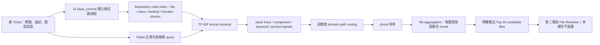

# 錯誤定位第一階段 v11：模型架構、實作進度與評估報告

## 1. 報告結論

第一階段「前 20 個候選檔案」在工程上已完成：輸入、索引、檢索、規則訊號、檔案聚合、Top-20 輸出、跨專案評估、信賴區間、斷點續跑與 frozen protocol 都已實作。正式方法為 `stage1-v11`，method ID 是 `tfidf-3e5e3b3cba1a`。

研究結果則必須分成兩層判讀：

- Development：Recall@20 = 93.33%（196/210），通過事前設定的 90% 門檻。
- 一次性跨專案 Holdout：Recall@20 = 84.44%（76/90），未通過 90% 門檻。
- 泛化差距：84.44% − 93.33% = −8.89 個百分點。

因此，目前可以報告「第一階段功能與可重現評估已完成」，但不能宣稱「第一階段已達到跨專案 90% 準確率」。下一版應針對跨檔案、公開 API 到底層實作的關聯建模，而不是繼續微調已看過的 Holdout。

## 2. 第一階段在整體架構中的位置



原始簡報中的「第一階段 Dual Encoder 語意檢索」應暫時改成「TF-IDF lexical retrieval + high-precision domain/path routing」。Dual Encoder 尚未成為正式方法；SBERT 候選重排已完成可比較實驗，但 Recall@20 下降，所以沒有選入 frozen v11。

## 3. 模型流程逐步說明

### 3.1 Ticket 輸入與資料防洩漏

模型只讀取部署時可取得的 Ticket 文字，例如標題、描述與錯誤訊息。Ticket ID、benchmark hints、測試名稱、patch 與 gold fixed files 不會進入檢索 query，避免答案洩漏。

### 3.2 固定版本的 Repository 快照

每一筆 SWE-bench ticket 都使用其 `base_commit`。Runner 會載入或建立該 commit 的隔離 snapshot，確保模型看到的是修正前程式碼，而不是目前分支或修正後內容。

### 3.3 程式碼索引

索引支援 Python、JavaScript/TypeScript、Java、C/C++、Go 與 Rust。Python 使用 AST 取得 module、class、method、function；其他語言目前以結構化 regex/block extraction 為主。正式設定：

- 排除 tests。
- chunk 80 行、overlap 20 行。
- 單檔最大 500,000 bytes。
- 索引以 repository + base_commit 快取。

### 3.4 Chunk-level 檢索與分數

正式 v11 的 chunk 分數為：

```text
chunk_score = clamp(
    0.50 × TF-IDF similarity
  + 0.30 × stack-trace/path evidence
  + 0.05 × component overlap
  + 0.08 × keyword overlap
  + 0.07 × symbol overlap
  + 0.18 × high-precision domain/path routing,
  0, 1
)
```

其中前五項是基礎檢索分數；domain/path 是稀疏、加成式的高精度 routing。每個候選會保留各項 `scoring_signals`、命中詞與理由，方便說明為何進入 Top-20。

### 3.5 Domain/path routing

此訊號把明確框架概念映射到高機率程式碼區域，例如 Django settings、URL resolver、migration serializer、query utilities 等。它只使用 Ticket 文字與 repository path，不讀 gold。

完整 Development 消融顯示，它把 Recall@20 從 87.14% 提升到 93.33%。但它在全新專案通常不會觸發，因此不能取代真正的跨專案語意或依賴關係模型。

### 3.6 File aggregation 與 Top-20 邊界

Chunk 排序後，系統依 `file_path` 分組。frozen v11 使用保守聚合：

```text
file_score = 該檔案最佳 chunk_score
```

其他 supporting chunks 仍會保留作為解釋，但不加分。實驗性的 supporting-chunk bonus、symbol-coverage bonus、package proximity，以及 generic identifier/import routing 都已實作為 opt-in；診斷實驗發現可能讓錯誤候選被放大，因此正式預設關閉。

聚合後明確保存 `stage1_candidate_files`，固定 20 個唯一檔案。這個欄位是第一階段的正式評估邊界，不再用最終 Top-5 反推第一階段表現。

## 4. 指標定義與本資料集的解讀

### Candidate Hit@20

只要 Top-20 至少包含一個正確修改檔案，該 Ticket 就算 hit：

```text
Hit@20 = 有命中至少一個 gold file 的 Ticket 數 / Ticket 總數
```

### Candidate Recall@20

每筆 Ticket 計算找回多少比例的正確修改檔案，再取平均：

```text
Recall@20 = mean(|Top20 ∩ GoldFiles| / |GoldFiles|)
```

目前 Development 210 筆與 Holdout 90 筆都只有一個 gold fixed file，所以 Hit@20 與 Recall@20 數值相同，也沒有 partial-recall case。未來若納入 multi-file fixes，兩者會分開。

### File Top-1/3/5 與 MRR

這些指標評估正確檔案在檔案排序中的前段位置。它們可補充排序品質，但第一階段的主要目標是 Recall@20，因為第二階段只能在這 20 個候選內繼續排序；若第一階段漏掉正確檔案，後續模型無法救回。

## 5. Development 消融實驗

三個方法使用相同 210 筆 Development 與相同 base-commit indexes：

| 方法 | Recall@20 | 相對 lexical | Top-1 | MRR | 判定 |
|---|---:|---:|---:|---:|---|
| TF-IDF lexical | 87.14% | — | 49.52% | 0.5869 | baseline |
| TF-IDF + domain/path routing | **93.33%** | **+6.19 pp** | 54.29% | 0.6405 | 選入 v11 |
| TF-IDF Top-50 unique files → SBERT → Top-20 | 86.19% | −0.95 pp | 54.76% | 0.6385 | 不選入 |

SBERT 的 Top-1 比 lexical 高 5.24 個百分點，但 Recall@20 比 lexical 低 0.95、比 routed 方法低 7.14 個百分點。第一階段的首要目標是不要漏掉正確檔案，因此不能只因 Top-1 較好就保留 SBERT。

早期 hybrid 實作曾直接從 Top-50 chunks 進行 SBERT，導致大量 chunks 集中在少數大檔案，平均只能輸出 12.57 個檔案。v11 已修正為「每個檔案先選最佳 TF-IDF chunk，再選 50 個唯一檔案」，使每筆都能輸出 20 個唯一候選；修正後仍未提升 Recall@20，所以被科學性淘汰，而不是因實作缺陷淘汰。

## 6. Frozen Development 結果

| 指標 | 結果 |
|---|---:|
| Tickets / failures | 210 / 0 |
| 平均候選數 | 20.00 |
| Hit@20 | 93.33%（196/210） |
| Recall@20 | 93.33% |
| Recall@20 bootstrap 95% CI | [90.00%, 96.67%] |
| Top-1 / Top-3 / Top-5 | 54.29% / 74.29% / 78.57% |
| MRR | 0.6405 |
| Full recall / partial / miss | 196 / 0 / 14 |

### Development 各 repository

| Repository | n | Recall@20 | miss |
|---|---:|---:|---:|
| django/django | 114 | 96.49% | 4 |
| matplotlib/matplotlib | 23 | 82.61% | 4 |
| psf/requests | 6 | 100.00% | 0 |
| pydata/xarray | 5 | 100.00% | 0 |
| pylint-dev/pylint | 6 | 66.67% | 2 |
| pytest-dev/pytest | 17 | 88.24% | 2 |
| scikit-learn/scikit-learn | 23 | 100.00% | 0 |
| sphinx-doc/sphinx | 16 | 87.50% | 2 |

整體 93.33% 受到 Django 的較大樣本量影響，因此報告時必須同時展示 per-repository 表。Pylint、matplotlib 與 Sphinx 已顯示跨專案表現不均，這也是執行嚴格 Holdout 的原因。

## 7. 一次性跨專案 Holdout 結果

Holdout 在模型、規則與參數封存後只執行一次。四個 repository 與 Development 完全不重疊。

| 指標 | 結果 |
|---|---:|
| Tickets / failures | 90 / 0 |
| 平均候選數 | 20.00 |
| Hit@20 | 84.44%（76/90） |
| Recall@20 | 84.44% |
| Recall@20 bootstrap 95% CI | [76.67%, 91.11%] |
| Top-1 / Top-3 / Top-5 | 53.33% / 75.56% / 78.89% |
| MRR | 0.6324 |
| Full recall / partial / miss | 76 / 0 / 14 |

### Holdout 各 repository

| Repository | n | Recall@20 | miss | Top-1 |
|---|---:|---:|---:|---:|
| astropy/astropy | 6 | 83.33% | 1 | 83.33% |
| mwaskom/seaborn | 4 | 100.00% | 0 | 75.00% |
| pallets/flask | 3 | 100.00% | 0 | 100.00% |
| sympy/sympy | 77 | 83.12% | 13 | 48.05% |

Holdout 有 77/90（85.56%）來自 SymPy，所以整體結果主要反映 SymPy。Seaborn 與 Flask 雖為 100%，樣本各只有 4 與 3，不能過度外推。

## 8. Holdout miss 判讀

14 筆 miss 是：

```text
astropy__astropy-14182
sympy__sympy-12236
sympy__sympy-13146
sympy__sympy-13895
sympy__sympy-13915
sympy__sympy-14024
sympy__sympy-17022
sympy__sympy-18087
sympy__sympy-20322
sympy__sympy-20590
sympy__sympy-21379
sympy__sympy-21612
sympy__sympy-21614
sympy__sympy-21627
```

主要模式如下：

1. **公開 API 與真正修改點不在同一檔案。** 例如 Ticket 指向 `lambdify`，但 gold 是 `printing/pycode.py`；Ticket 說 `simplify`，gold 可能是 `core/exprtools.py`、`core/numbers.py` 或 `core/mul.py`。
2. **數學症狀文字與底層實作詞彙差異大。** `apart`、指數化簡、substitution、`is_zero` 等症狀不一定直接出現在真正修正檔案的文字與檔名中，純 lexical retrieval 容易選到表面相關模組。
3. **跨檔案 dependency/call relation 未進正式分數。** import-neighbor 與 package proximity 已有實驗性實作，但目前方法無法穩定判斷「呼叫端問題實際要修被呼叫端」，所以 frozen v11 關閉這些加成。
4. **框架 routing 對新領域幫助有限。** v11 的高精度規則主要來自 Development 可驗證的框架概念；對全新的 SymPy 深層核心語意幾乎不觸發。

這些 miss 不是單純把 Top-20 改大就能解決的證據；它們指出目前缺少「Ticket 中的操作／API → repository 內部實作依賴」的泛化表示。

## 9. 已完成、未採用與下一版邊界

### 已完成並進入 frozen v11

- base-commit repository snapshot 與多語言 code index。
- 明確、固定 20 個唯一檔案的第一階段輸出。
- TF-IDF、stack trace、component、keyword、symbol scoring。
- 經完整 Development 驗證的 domain/path routing。
- basic file aggregation 與可解釋 scoring signals。
- per-repository 指標、miss IDs、bootstrap 95% CI。
- checkpoint/resume、method ID、frozen config 驗證。
- Development/holdout 資料、模型設定、程式碼與結果 SHA-256 封存。

### 已實作但未進正式模型

- generic identifier/path routing。
- import/dependency-neighbor proximity。
- supporting-chunk、symbol-coverage、package-proximity aggregation。
- TF-IDF Top-50 unique files → SBERT reranking。

原因不是功能未完成，而是目前沒有穩定提高 Recall@20，部分診斷資料反而回歸；因此以 feature flag 保留，正式預設關閉。

### 下一版研究優先順序

1. 建立 API/symbol 到實作檔案的靜態 call/import graph，將關係作為可驗證的候選擴張，不直接用固定加分。
2. 以新的 training/development projects 訓練或驗證 code-aware dual encoder；不得再用本次 Holdout 調參。
3. 做 query expansion：從 Ticket 的 API、exception、symbol 找定義與呼叫者，再檢索其一至二跳 dependency files。
4. 對 repository size 與候選密度做校準，避免大型 SymPy 類專案被大量表面相關檔案淹沒。
5. 建立新的未見專案 Holdout 評估下一版；本次 84.44% 保留為 v11 的最終結果。

## 10. 可重現性產物

- `stage1_v11_freeze_manifest.json`：在開啟 Holdout 前封存設定、Development、資料集與核心程式碼雜湊。
- `stage1_v11_final_evaluation_manifest.json`：驗證 Holdout 與 frozen 方法完全相同，狀態為 `holdout_evaluated_once`。
- `stage1_v11_frozen_development/test_metrics.json`：Development 完整與各 repository 指標。
- `stage1_v11_frozen_holdout/test_metrics.json`：一次性 Holdout 完整與各 repository 指標。
- `stage1_ablation_v11_comparison.json`：三個完整 Development 消融方法比較。

## 11. 教授報告時的建議說法

> 第一階段的目標不是直接選出唯一修正檔案，而是在不讀 patch 或 gold 的前提下，把 repository 縮小為 20 個候選檔案，提供第二階段重排。工程上已完成固定 Top-20、可解釋分數與 frozen 評估。Development Recall@20 為 93.33%，但完全不同專案的單次 Holdout 為 84.44%，所以目前模型通過功能完成度，尚未通過 90% 跨專案泛化門檻。消融顯示高精度 routing 有效，但 SBERT 重排沒有提高 Recall@20；下一版會集中在 API 到底層實作的 dependency/call graph 建模。
